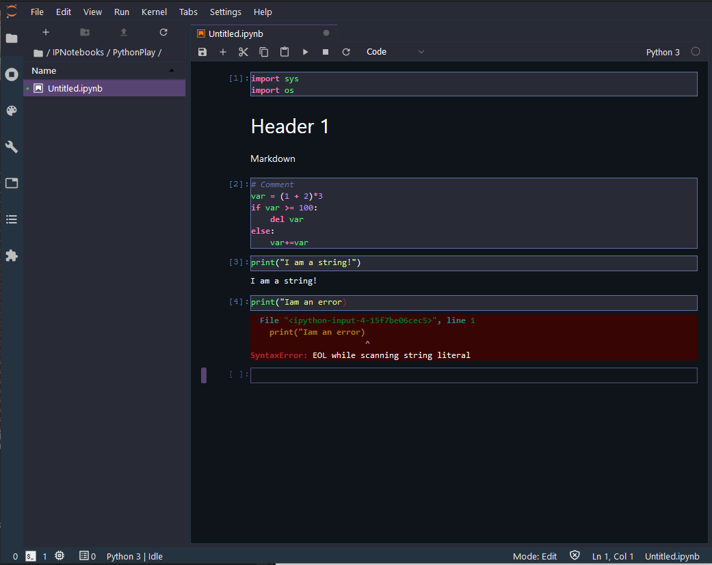

# JLDracula


[](https://badge.fury.io/py/JLDracula.svg)

# Dracula for [JupyterLab](https://jupyter.org/)

> A dark theme for [JupyterLab](https://jupyter.org/)



## Requirements

* JupyterLab >= 3.0

## Install

All instructions can be found at [draculatheme.com/jupyterlab](https://draculatheme.com/jupyterlab).

```bash
pip install JLDracula
```


## Uninstall

```bash
pip uninstall JLDracula
```
## Team

This theme is maintained by the following person(s) and a bunch of [awesome contributors](https://github.com/dracula/jupyterlab/graphs/contributors).


[](https://github.com/karosc) |
--- |
[Constantine Karos](https://github.com/karosc) |

## Community

* [Twitter](https://twitter.com/draculatheme) - Best for getting updates about themes and new stuff.
* [GitHub](https://github.com/dracula/dracula-theme/discussions) - Best for asking questions and discussing issues.
* [Discord](https://draculatheme.com/discord-invite) - Best for hanging out with the community.

## License

[MIT License](./LICENSE)